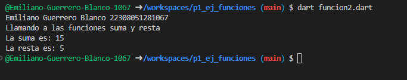
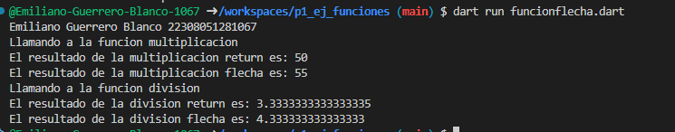
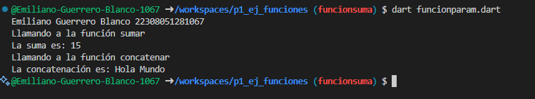

EJemplo de salida

ejemplo de salida funcion normal + funcion flecha

ejemplo de salida de dos ejemplos de funciones con parametros posicionales

ejemplo de salida del ejercicio 6. Producto de la lista
